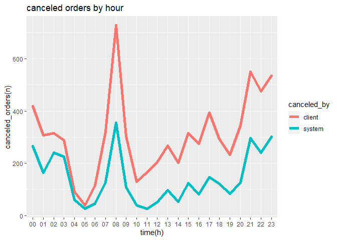
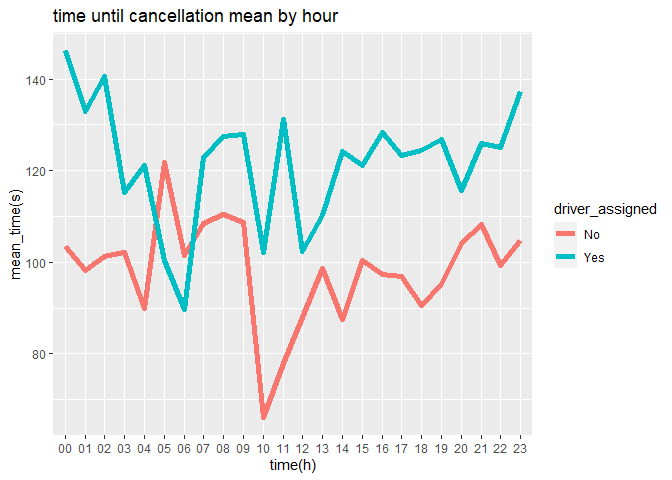
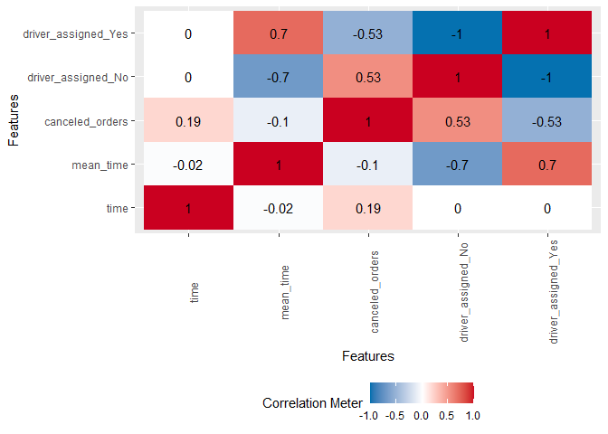
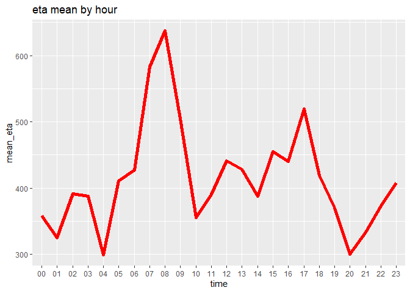

gett_analysis
================
Daniel Schnietz
2023-08-01

## Notice:

This is the RMD analysis document for the Gett dataset of
Stratascratch.com. The analysis done is strictly done on the given
tasks. Deeper analysis of the data with more / all given data and
insights will follow in another showcase. Also the analysis is done with
a reasonable toolkit. E.g. there are no missing values generated if it’s
not necessary to get reasonable good insights on the data.

## Introduction

Gett wants to get insights on orders that didn’t end up successfully in
their GTM platform. I.e. a customer not getting a car. To further
understand the distribution of cancellations across different hours over
the day and cancellations done by the system / client we are analysing
the provided data_orders dataset. The dataset contains 10716 entries of
the following collumns:

order_datetime

origin_longitude

origin_latitude

m_order_eta

order_gk

order_status_key

is_driver_assigned_key

cancellations_time_in_seconds

##### This analysis includes insights on the following key questions:

How orders according to reasons for failure are distributed?
Cancellations before and after driver assignment, and reasons for order
rejection. Which category has the highest number of orders?

Is there a trend that certain hours have an abnormally high proportion
of one category or another? What hours are the biggest fails? How can
this be explained?

How does the assignment of a driver affect the average time to
cancellation at different hours?

How does the mean of the ETA look throughout the day?

### Definitions

##### GTM:

Ground Transportation Management

#### ETA:

Estimated Time of Arrival

## Analysis

### Structure of the data

| order_datetime | origin_longitude | origin_latitude | order_eta |     order_id | order_canceled_by | driver_assigned | cancellations_time_in_seconds | eta_missingness | cancellations_time_missingness |
|:---------------|-----------------:|----------------:|----------:|-------------:|:------------------|:----------------|------------------------------:|:----------------|:-------------------------------|
| 18:08:07       |        -0.978916 |        51.45617 |        60 | 3.000583e+12 | client            | TRUE            |                           198 | FALSE           | FALSE                          |
| 20:57:32       |        -0.950385 |        51.45684 |         0 | 3.000583e+12 | client            | FALSE           |                           128 | TRUE            | FALSE                          |
| 12:07:50       |        -0.969520 |        51.45554 |       477 | 3.000583e+12 | client            | TRUE            |                            46 | FALSE           | FALSE                          |
| 13:50:20       |        -1.054671 |        51.46054 |       658 | 3.000583e+12 | client            | TRUE            |                            62 | FALSE           | FALSE                          |
| 21:24:45       |        -0.967605 |        51.45824 |         0 | 3.000583e+12 | system            | FALSE           |                             0 | TRUE            | TRUE                           |
| 21:21:23       |        -0.947011 |        51.45638 |         0 | 3.000583e+12 | system            | FALSE           |                             0 | TRUE            | TRUE                           |
| 07:58:15       |        -0.955637 |        51.47037 |         0 | 3.000583e+12 | system            | FALSE           |                             0 | TRUE            | TRUE                           |
| 07:53:46       |        -0.978230 |        51.45457 |         0 | 3.000583e+12 | system            | FALSE           |                             0 | TRUE            | TRUE                           |
| 08:53:01       |        -1.052298 |        51.45431 |         0 | 3.000583e+12 | system            | FALSE           |                             0 | TRUE            | TRUE                           |
| 06:33:52       |        -0.976216 |        51.43320 |         0 | 3.000583e+12 | client            | FALSE           |                            78 | TRUE            | FALSE                          |

### Distribution of canceled orders by client / system with both, driver assigned and no driver assigned.

<!-- -->

Plot shows that most orders are canceled while there is no driver
assigned. In terms of canceled orders by the system there are nearly no
canceled orders once a driver is assigned (3).

If we take a closer look on canceled orders by hours, we see that
cancellations by client are almost double the amount of cancellations by
the system. This represents the results of the previous plot. Except for
the time between 3am and 6am. At this time the cancellations by client
go almost back to the amount of cancellations by the system. Highest
cancellations are done at rush hour times (e.g. 8am and 17pm)

### Orders canceled by hour

<!-- -->

### Average time until order is canceled

<!-- --><!-- --><!-- -->

Mean tends to increase in the morning between 7am and 10am. Notice how
the time for orders with no driver assigned tends to react in the other
direction. As time for assigned driver orders goes down, time for orders
with no driver assigned goes up. It seems like the time, time until the
order is canceled and number of canceled orders are kinda related.

### Verify insights on correlation

<!-- -->

### Mean ETA by hours

<!-- -->

This plot of the ETA just represents orders where a driver is already
assigned, as it’s impossible to estimate a time without a driver even
being assigned. ETA tends to increase in times of rush hour and drop
down drastically at times where usually less traffic is on it’s way.
These time frames are those, where the most cancellations are observed.

### Conclusion

Data shows that most cancellations are done in busy times were less
drivers are available, more traffic is on it’s way and drivers take a
longer time to get to the customer. Even though the time until a
cancellation is done increases at these times, there are still more
cancellations registered. In this case, a deeper analysis of available
drivers and the distribution of drivers and orders could help to improve
in terms of availability and eta.
